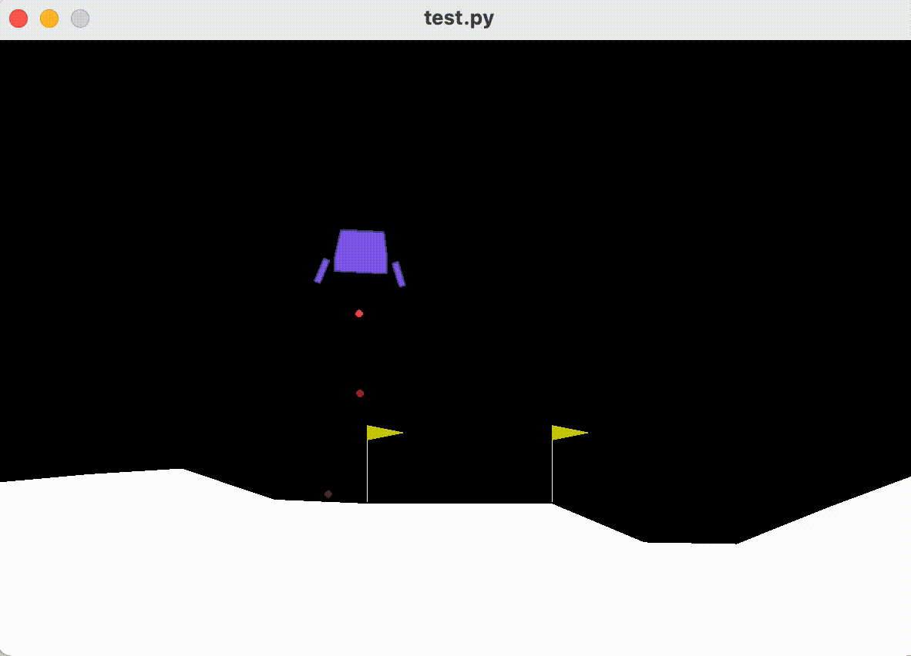
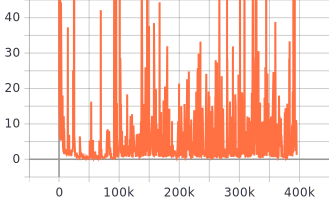
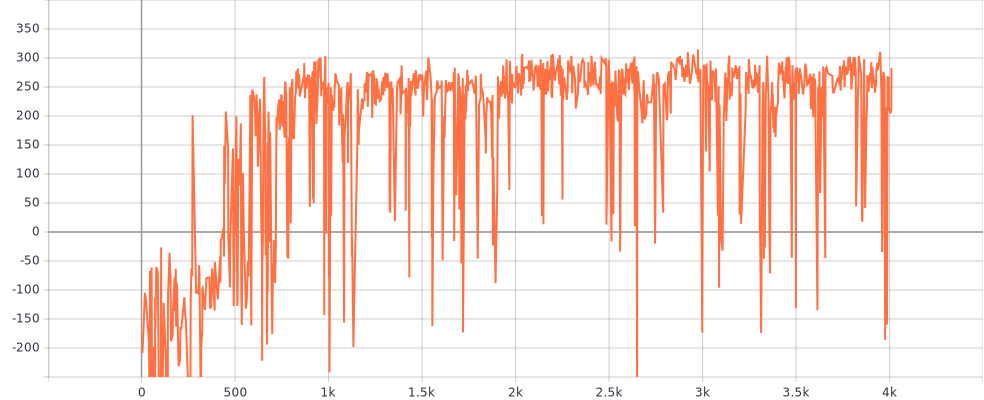

# Lunar Landing

https://gym.openai.com/envs/LunarLander-v2/

HW12 on https://speech.ee.ntu.edu.tw/~hylee/ml/2021-spring.html

https://colab.research.google.com/github/ga642381/ML2021-Spring/blob/main/HW12/HW12_ZH.ipynb

Demo:

Loss:

Reward:

Ref: https://blog.csdn.net/KGV093/article/details/111415071?utm_medium=distribute.pc_relevant.none-task-blog-2%7Edefault%7EBlogCommendFromBaidu%7Edefault-6.baidujs&depth_1-utm_source=distribute.pc_relevant.none-task-blog-2%7Edefault%7EBlogCommendFromBaidu%7Edefault-6.baidujs

